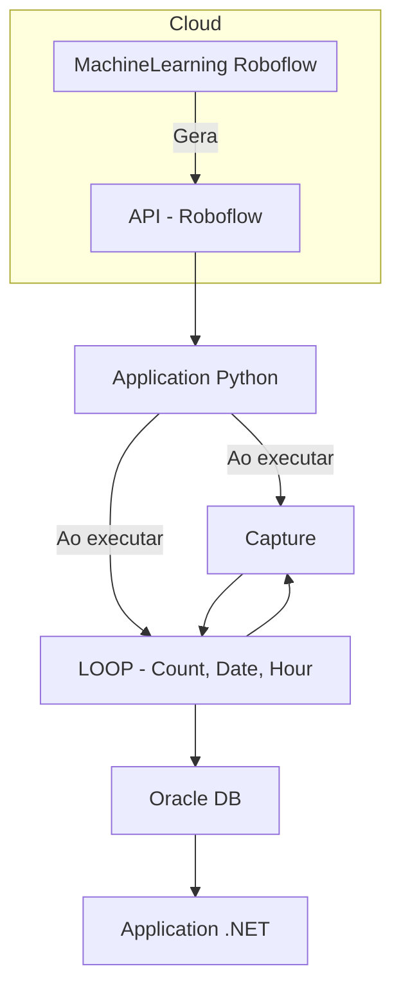

SafeYard - Detecção de Motocicletas 🏍️
=======================================

Este projeto detecta motocicletas em tempo real usando Roboflow e OpenCV.
Funcionalidades
---------------
✅ Detecção de motocicletas em tempo real via câmera ou vídeo local  
✅ Contagem automática de motocicletas detectadas  
✅ Exibição visual das detecções usando OpenCV  
✅ Pipeline com workflow do Roboflow para processar os frames  
✅ Modularização com funções separadas para câmera e vídeo  
✅ Impressão em tempo real da quantidade de motocicletas identificadas  
✅ Facilidade de integração com outras funcionalidades (por exemplo, alertas ou armazenamento de dados)

Requisitos
----------
⚠️ **IMPORTANTE**: Este código funciona apenas com Python 12 ou versões anteriores devido à biblioteca LLM utilizada.

- Python 3.7+ (máximo Python 12)
- inference (Roboflow SDK)
- opencv-python

Instalação
----------
1. Clone o repositório:
   git clone https://github.com/seu-usuario/safeyard-detection.git
   cd safeyard-detection

2. Instale as dependências:
   pip install
   pip install inference opencv-python

Configuração
------------
Edite no código:
- API_KEY = "sua_chave"
- WORKSPACE = "seu_workspace"
- WORKFLOW_ID = "seu_workflow"

Uso
---
Para usar com webcam:
    p_camera(API_KEY, WORKSPACE, WORKFLOW_ID)

Para usar com vídeo local:
    p_local(API_KEY, WORKSPACE, WORKFLOW_ID, "videos/video.mp4")

Architecture
------------

@Autor
-----
Projeto SafeYard
